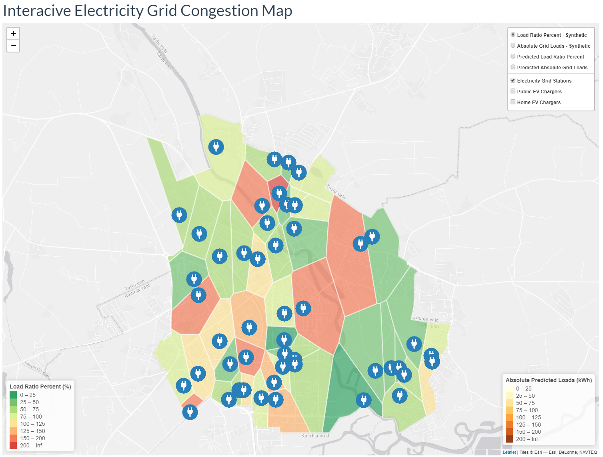

## Who are we, why did we do the project, why is it necessary and how did we do it

We are four Data Science students (Joonas Ariva, Sille Habakukk, Katrin Raigla and Ilmar Uduste) who took on the challenge of visualizing and predictintg grid congestion in our Machine Learning course. This is an important task because it can be expected that electrical vehicles (EV) are going to be bought more during the next decade. Because of that, electricity consumption will increase and since all customers want to receive the same pleasant EV charging experience, grid overloads must be predicted and a smart charging model must be implemented.

The task was given to us by Eesti Energia (project owner and our contact person: Kristjan Eljand). We predicted grid consumptions on different 24-hour based models and on ARIMA time series.

<b>The Shiny dashboard that we built to visualize the electricity grid congestion:</b> https://ilmaru.shinyapps.io/dashboard/

<b>Our presentation (Google Slides link):</b> https://docs.google.com/presentation/d/1Jpxc1xjJAhh_5dK-pYAsiQgWtm7-kd7ii3tlTGXHc4g/edit?usp=sharing

___

*"Practical work is an essential part of learning. We offer you an opportunity to test your newly acquired machine learning skills against real-life problems."*

___

## The provided data
 * Grid topology that reflects the capabilities of the grid at given location (the capabilities of the substations, electric lines, etc.)
 * Simulated data of 100 electric vehicles that includes information about each EV and the prediction of their charging pattern.

## The tasks given by Eesti Energia (Kristjan Eljand):
  * Prepare the datasets for analysis;
  * Develop a prediction model that forecasts the grid load in specific location based on EV charging statistics.
  * Develop a model for smart charging – a model that divides the electricity consumption of EVs such that the limits of the grid won’t be exceeded and all of the EV owners receive the similar experience.
  * Develop a graphical user interface (GUI) with following functionality (extra): 
    * enables to select a time of day (hour) and location as an input and shows grid load forecast.
    * shows the optimized charging schedule if there is a threat of grid congestion.

## Where we got more info:
  * By asking Kristjan Eljand himself:
    * Grids must be connected with nearest charging stations with a straight line (buildings, Emajõgi and everything else is also excluded)
    * Grid baseloads show consumption without ev charging 
    * When a car is charging, then it always uses it's max charging power.
    * We have to face charging problems when they happen (on the same hour) and not predict them.
    * We also asked for more data - we did not get it.
  * By asking Dima:
    * What can be done with such type of data: https://ieeexplore.ieee.org/abstract/document/7796887
    * ARIMA as a baseline
    * With ensembling of multiple LSTMs and MLPs - must make sure, that data is not overfitted
  * By asking other people:
    * With R code, a master's thesis with ARIMA (predicting hospital's patients) https://dspace.ut.ee/bitstream/handle/10062/64858/soll_hanna_liisa_msc_2019.pdf?sequence=1&isAllowed=y
    * Seasonal ARIMA models : https://otexts.com/fpp2/seasonal-arima.html

## Lessons Learned:
  * Data Scientist usually never get enough data, so the task is never easy

## Work Done:

Goal: Predict EV charging current at specific hour at specific location
1200 data points, 422 non-zero values, mean 23.131754 min 6.600000 max 121.700000

### Things we tried for machine learning
  * Fitting one model for every hour of the day (24 models)
    * Linear regression, ElasticNet, random forest.
    * Input parameters combinations of: number of public and home chargers, max current, baseload, coordinates.
    * R2 values between -1..0, RMSE 9.8 .. 12.
  * Models:
    * Random Forest 
    * Simple Neural Network 
    * Linear Regression (regular, ridge and ElasticNet)
    * AR(I)MA - autoregressive integrated moving average
      * Combined similar charging stations into “one” to create longer time series.
 * Features:
    * of connected home charging stations
    * of connected public charging stations
    * Coordinates
    * Hour of the day
    * Previous values
    * Baseload
    * Max current

### Things we used in the final work
  * Models:
    * Random Forest
  * Features:
    * of connected home charging stations
    * of connected public charging stations
    * Hour of the day

### Smart charging
  * Reduce current for chargers when overload was predicted.
  * (predicted current - maximum current) / number of chargers
  * In total there were 121 situations where smart charging should have been applied.
  * Our models detected 68 of them sufficiently (throttled enough, or more). 
  * Other 53 cases the throttling was either not enough, or not applied at all.
  * Additionally 4 cases, when throttling was applied unnecessarily.

### Things we tried for visualisation
  * matplotlib - ggplot2
  * A map is needed:
    * geopandas and folium
    * r and leaflet
    
### The thing we used for visualisation:
  * Shiny Dashboard
  
___

## Final presentation: Dec 14 - 16 guidelines
  * At least one member from the team (can be more than one) makes a presentation about the project.
  * As intermediate presentations, the final presentation will also be held solely online with two practice session leaders grading the presentations over Zoom.
  * You have 5 minutes to make the final presentation
    * In the presentation make sure to introduce your team and project owner (if applicable);
    * Briefly remind us the problem you are trying to solve (say why it needs to be solved);
    * Explain what was your approach to the problem (your methods);
    * Detail results you have obtained and how they match the initial expectations;
    * Lastly, describe a few main lessons that you have learned while working on the project.

## Grading
  * They will grade our presentations based on roughly the following criteria:
    * amount and complexity of work performed (40%),
    * quality of presentation (30%),
    * degree to which you have completed the initial task (25%),
    * being on time (5%).

___
